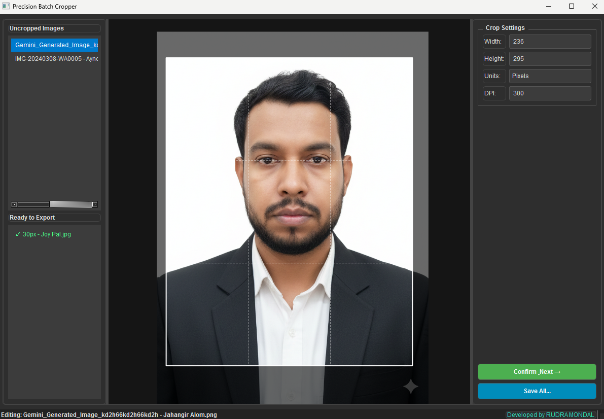

# Batch Image Cropper

A desktop batch image cropping tool for quickly preparing multiple images at a consistent size and aspect ratio.

Built with **Python**, **PySide6**, and **Pillow**, the app gives you a visual crop preview, mouse-based pan/zoom controls, target output dimensions, DPI-aware physical units, and one-click batch export.



## Features

- Drag and drop multiple images into the app
- Preview each image with a fixed crop overlay
- Pan and zoom while the image stays constrained to the crop area
- Rule-of-thirds grid for easier composition
- Set target dimensions in pixels, inches, or centimeters
- Configure DPI for print-oriented exports
- Confirm crops one by one, then save all processed images together
- Preserves common image formats including JPG, JPEG, PNG, BMP, and TIFF
- Applies EXIF auto-rotation when loading images

## Requirements

- Python 3.10 or newer recommended
- Windows, macOS, or Linux with a desktop environment supported by Qt

Python dependencies are listed in [`requirements.txt`](requirements.txt).

## Installation

Clone the repository:

```bash
git clone https://github.com/rudra-mondal/batch-image-cropper.git
cd batch-image-cropper
```

Create and activate a virtual environment:

```bash
python -m venv .venv
```

On Windows PowerShell:

```powershell
.\.venv\Scripts\Activate.ps1
```

On macOS or Linux:

```bash
source .venv/bin/activate
```

Install dependencies:

```bash
pip install -r requirements.txt
```

## Run the App

```bash
python app.py
```

## How to Use

1. Launch the app.
2. Drag and drop image files into the window.
3. Select an image from the **Uncropped Images** list.
4. Set the target width, height, units, and DPI.
5. Use the mouse wheel to zoom and drag the image to position it inside the crop frame.
6. Click **Confirm & Next** to queue the crop.
7. Repeat for the remaining images.
8. Click **Save All...** and choose an output folder.

Exported files are saved with `_cropped` added to the original filename.

## Build an Executable

This project includes PyInstaller in its dependencies. If you want to create a distributable desktop build, run:

```bash
pyinstaller Precision_Batch_Cropper.spec
```

The generated build files will be placed in `build/` and `dist/`.

## Project Structure

```text
.
|-- app.py
|-- requirements.txt
|-- docs/
|   `-- Screenshot.png
`-- README.md
```

## Tech Stack

- [PySide6](https://doc.qt.io/qtforpython-6/) for the desktop interface
- [Pillow](https://python-pillow.org/) for image cropping, resizing, and saving
- [PyInstaller](https://pyinstaller.org/) for optional executable builds

## License

This project is licensed under the MIT License. See [`LICENSE`](LICENSE) for details.
